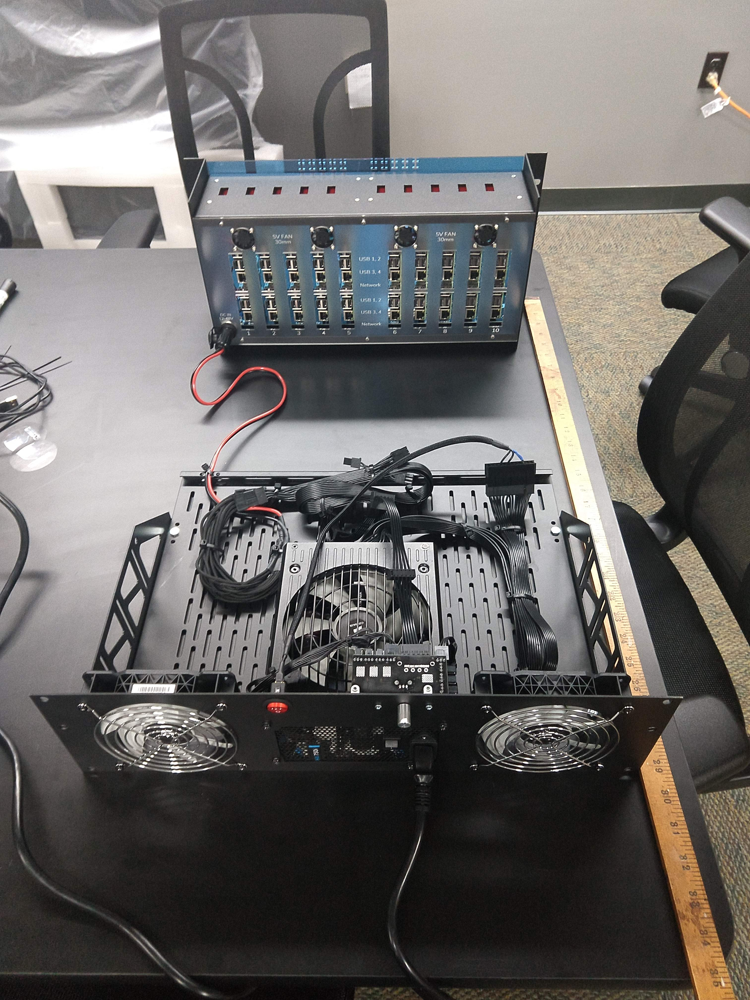
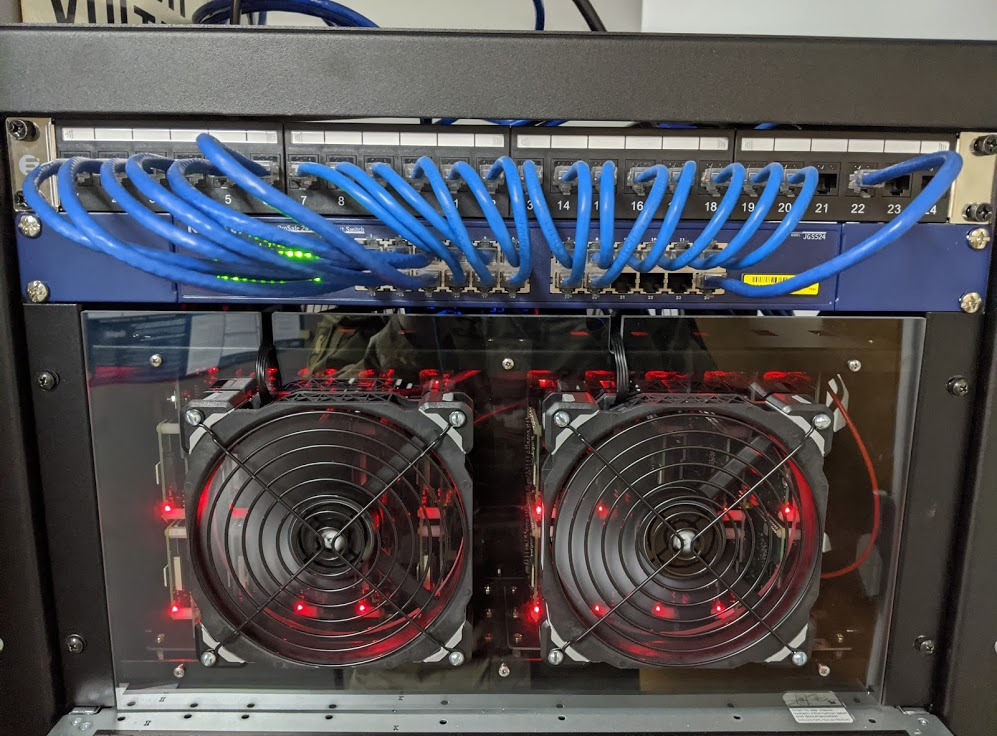

# Cluster

> The cluser is named **Beauty** because she runs like a **Beast**!

This page describes the design, setup, and modifications to our cluster.

## Single Board Computers

Raspberry Pi 3 B+

@anyone want this part?

## Rack Chassis

BitScopeBlade

@RWB02 I think you have the best handle on this part.

## Custom Power Supply

To facilitate the rack mounted BitScope blade, we built a custom power supply and attached it to a 2U rack shelf that we extended to 3U to fit the power supply.

The power supply also has the Corsair iCue compatibility which allows us to monitor the DC power draw on the cluster side of the power supply, which allows us to disregard the power supply's efficiency to gain more precise results.

We purchased the below parts to build our rack mounted power supply:

| Description                          | Each    | Quantity | Total   | Link                                     |
|--------------------------------------|---------|----------|---------|------------------------------------------|
| Corsair HX750i 750W ATX PLATINUM PSU | $153.98 | 1        | $153.98 | https://www.newegg.com/p/N82E16817139084 |
| CRJ 24-Pin ATX Red LED Power Switch  | $8.99   | 1        | $8.99   | https://smile.amazon.com/dp/B01MSY4966   |
| Corsair ML120 120mm Fan 2-Pack       | $33.59  | 1        | $33.59  | https://www.newegg.com/p/1YF-001H-00185  |
| Fan controller                       | $21.39  | 1        | $21.39  | https://www.newegg.com/p/376-0067-00001  |

Total: $217.95

We also used the following on-hand components:

- 2x 120MM fan grills
- Shallow depth 2U rack shelf
- Aluminum sheet metal

[High res](power_mounted.jpg)

[High res](power_with_cluster.jpg)

We initially mounted these fans in intake mode, but after we added the two additional fans (below), we switched them to exhaust mode.

## Additional Fans

The 1x1 inch fans that were part of the fully enclosed BitScopeBlade Chassis had almost no effect on the cooling performance of the Raspberry Pis.
Even after we added intake fans to the 

#### Parts

We purchased the below parts to upgrade the cooling on our cluster.

| Description                         | Each   | Quantity | Total  | Link                                   |
|-------------------------------------|--------|----------|--------|----------------------------------------|
| Apevia 140mm Black Fan Grill 3-Pack | $8.99  | 1        | $8.99  | https://smile.amazon.com/dp/B01BW21DXC |
| Corsair ML140 Pro 140mm Fan         | $30.88 | 2        | $61.76 | https://smile.amazon.com/dp/B01G5I6MW0 |

Total: $70.75

We also used some semi-transparent polycarbonate that we had on hand to fabricate a replacement front facia for the cluster with the fans and their grills attached in intake mode.

[High res](custom_facia_and_switch.jpg)
